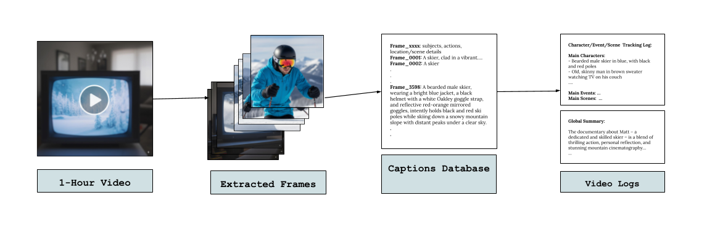
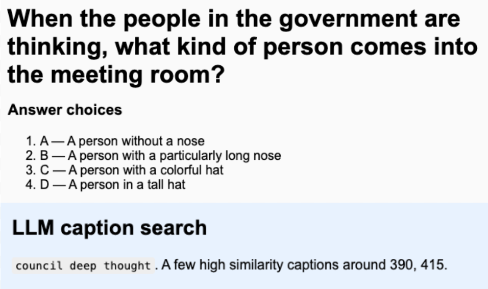
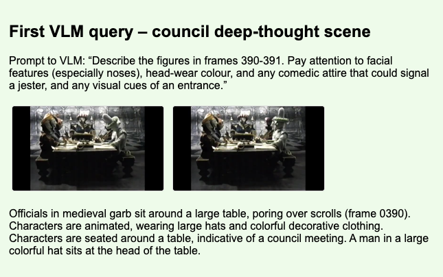
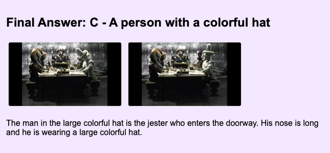
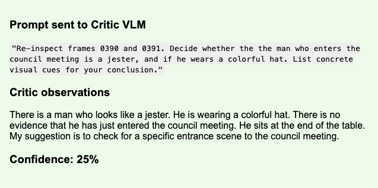
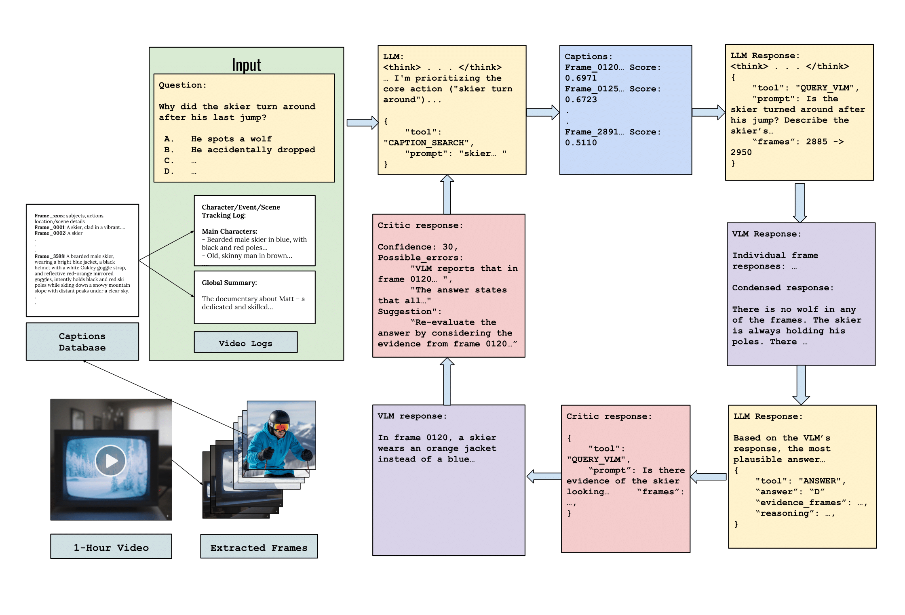
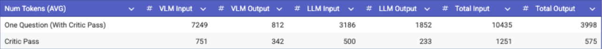

<!-- MathJax setup -->

# Long-Context Video Understanding: An Agentic Approach

---

Imagine a future where AI lives in the physical world. It sees what we see, learns from natural processes, and helps solve real-world problems. Humans constantly process visual information over time, recognizing patterns, recalling key moments, and building understanding from hours of experience. AI should be able to understand long videos the way humans do.

## The Challenge

Current AI models have a fixed context length. A single highly compressed 1 hour video holds around **1 million tokens**, making it difficult for AI to reason through long visual contexts. Even with fully linearized attention, the visual data we generate daily will exceed what any model can process in a single pass.

We need a fundamentally different approach to understand and process multi-hour videos.

Solving long-context video understanding requires three key parts:

1. **An efficient offline video representation**
2. **Smart retrieval of relevant moments**
3. **Strong reasoning over visual and temporal information**

## Our Solution

We propose an **agentic method** for understanding long videos that addresses each of these components using fully open-source models. Our approach utilizes the ReAct framework, which integrates reasoning with tool use. Within this framework, an LLM can both perform step-by-step reasoning and invoke external resources, such as searching through a captions database and communicating with other multimodal LLMs.

Prior work such as Deep Video Discovery has explored agentic systems for long-video evaluation, and we build on these ideas and push them further.

While reasoning agents are powerful, they remain prone to alignment errors, lossy image-to-text translation, and hallucinations. During our experiments, we noticed their fragility and unreliability, especially on subjective visual data. To address these issues, we introduce a third-party **critic module** that evaluates agent outputs, identifies discrepancies, and prompts re-evaluation.

## The Pipeline

### Step 1: Building an Efficient Offline Video Representation

We first take in a video input, extract frames at **1 fps**, and store them in a frame database.

For each frame, we use an LLM to capture a detailed description and build a captions database consisting of:
- Subjects in the frame
- Actions taking place
- Location and scene details

Once these captions are parsed, we chunk them and pass through an LLM one more time to generate:

- **Character log**: Physical descriptions of recurring characters and their potential roles in the long videos
- **Event log**: Different landscapes and settings the video is filmed in
- **Global summary**: The general mood of the film, coloring and type of film, plot line, and notable elements

Once we have our caption database, we embed it using an open-source token embedder, so we can semantically match captions with queries.

{: width="600px" .center}

This representation is:
- **Expandable**: If we have video data streamed in, we can continue adding linearly to our database. The entire video doesn't need to be fed to a model over again to maintain history.
- **Compact**: Storing captions in addition to the video takes up very little space.
- **Versatile**: It's detailed at different granularities, so the model has relevant information depending on the type of question asked.

### Step 2: Smart Retrieval of Relevant Moments

Next, we construct a multi-turn pathway between a reasoning LLM and a VLM. An LLM receives a question query from a user and can choose between three actions:

**Action 1: Semantic Caption Search**

The LLM generates a short "search query" from the user query and performs a cosine-similarity algorithm between the search query and the image captions in the database. For example:

The search algorithm returns the **top k = 40** caption-similarity scores with timestamps, and the LLM reads and clusters relevant timestamps.

**Action 2: Query the VLM with Chosen Frames**

Following the previous example, the LLM may have pinpointed relevant frames from captions regarding when a council appears deep in thought, but needs more detail. It can query a VLM with a question of choice:

The VLM returns a chain of thought with a response to the LLM's prompt. For each VLM call, we also attach the global summary to provide required context.

**Action 3: Decide on a Final Answer**

Depending on how much information it has received, the LLM can then choose to perform more caption search queries, query the VLM with a different question prompt or different frames, or decide on a final answer.

We limit the total number of LLM actions to **10** before the LLM is forced to decide on a final answer.

### Step 3: The Critic Agent

We notice that when the LLM queries the VLM asking for specific visual information, the VLM has a tendency to "hallucinate" or exaggerate details of the subjective visual data to force a fitting answer to the LLM's queries.

Similarly, the LLM may make certain assumptions that aren't explicitly seen from the frames. An example following the question we've been exploring:

The question asked "what kind of person comes into the meeting room," yet the LLM receives information describing the people seated at the table and assumes one of those were the ones that entered the meeting room. It's easy for the LLM to lose small details of the question or to assume information from structured VLM responses.

To remediate, we run a second pass through a critic model, which takes in the original question, global summary, LLM's reasoning, and the relevant VLM frames chosen by the LLM. 

The critic agent also has access to a critic VLM and analyzes the LLM's reasoning + evidence in relevant frames as a sanity check. An example pass through the critic VLM:

The critic analyzes the visual data with the accompanying reasoning and determines a confidence score and suggestions for the VLM.

If the confidence score is below a threshold **T = 70%**, the critic's reasoning is passed back to the acting LLM, and the LLM follows its suggestions for re-evaluating, utilizing the same three tools as earlier.

An example of the entire pipeline can be seen here:

To see the full walkthroughs of questions, please visit our [interactive demo](https://klu921.github.io/agentic_lv_demo/).

## Results

Our agentic video pipeline on the open-source models **DeepSeek V3.1** and Meta's **Llama-4-Maverick VLM** performs **state-of-the-art** on the LVBench dataset:

- **60.19%** accuracy with no critic pass-through
- **65.18%** accuracy with critic pass-through

On a random sample of videos from the HourVideo dataset, the pipeline is able to correctly identify relevant frames as annotated and reviewed by humans in the dataset **68.19%** of the time, showing the strength of our representation.

## Token and Cost Analysis

**Context:** A normal hour-long video compresses to about 1,000,000 tokens. If you naively pass the entire video for every question, you spend ~1M input tokens per question, which is expensive and slow, especially in streaming settings.

With an offline representation that can be re-queried, we can save token costs through amortization. We precompute multi-granularity captions once, then retrieve only relevant information and context at query-time.

With the critic enable*, a typical Q&A cycle looks like:

- **Per question**: About 10,435 input tokens and 3,998 output tokens (combined across VLM and LLM), costing roughly **~$0.03** on the most expensive open-source options
- Of that, the critic pass contributes roughly 1,251 input and 575 output tokens (i.e., ~12-13% of the per-question total)

Across **16 questions**, we spend:
- 166,960 input tokens
- 63,968 output tokens
- Total: ~230,928 tokens

This is approximately 23% of a single 1M-token hour and **96× smaller** than a naive pass through the video 16x (1M tokens × 16 questions).

**The amortization effect:** The heavy lifting of the models(captions and embeddings) is reused, so the incremental cost of each new question stays near ~10k input + ~4k output tokens, without exceeding context windows for long videos. We still account for the initial video representation cost.

**Critic trade-off:** We add ~12.7% more tokens per question to achieve ~5.98% absolute accuracy gain. If quality matters, run the critic conditionally on confidence for customizable accuracy-cost trade-offs.

In a streaming setting, instead of having to pass the entire video and its past history through a model when new context comes in, we can cache the captions database and add to it as new frames come in, saving token costs.

## Limitations and Discussion

The approach inherits limitations from captioning-based retrieval:

- **Frame-level captions can be lossy** and ignore subtle but important cues (e.g., identity, small objects, fine-grained actions)
- **Agent reliability is sensitive** to prompt engineering and the probabilistic nature of decoding; although the critic reduces variance, performance can still degrade when initial key-frame selection is incorrect
- **Multi-granularity captions introduce representation bias**: Omissions in the captions and implicit biases can cause hallucinated or stretched findings

Despite these constraints, hierarchical retrieval from the frame level to the global summary level, combined with a **Reason → Act → Critique → React** loop, provides a useful balance. The method restricts the LLM's working set to relevant evidence, defers to vision models when necessary, and uses a critic to flag inconsistencies and prompt re-evaluation.

## Future Work

Future directions include:

- **Stronger video representation**: More detailed captioning for small objects/identity or a latent-space representation
- **Adaptive frame sampling**: Sampling frames at different rates (e.g., on more stagnant scenes, sampling at a lower rate, while in action-packed scenes, sampling at a faster rate) to save tokens
- **Grounding critic evaluations**: Providing a stronger framework to evaluate the validity of reasoning claims with subjective visual data.
- **Parallel search**: Parallel search over many different frame-ranges to identify the most relevant scenes for the question
- Robust captioning for different types of questions
- 

## Conclusion

Long-context video understanding is fundamentally a systems integration problem requiring compact multimodal representations, targeted retrieval, and a strong reasoning cycle. The proposed agent combines hierarchical captions, semantic search, VLM-based image understanding, and a critic to improve robustness.

On open-source models, this pipeline yields **state-of-the-art performance on LVBench at 65.19% accuracy**, with an approximately **6% absolute accuracy improvement** at approximately **13% additional tokens** per question using the critic model.

The future of AI isn't necessarily about bigger context windows. It's also about smarter systems that know what information to search for and how to reason. Just like humans don't remember every second of a movie but can recall key moments when asked, AI should work the same way.

