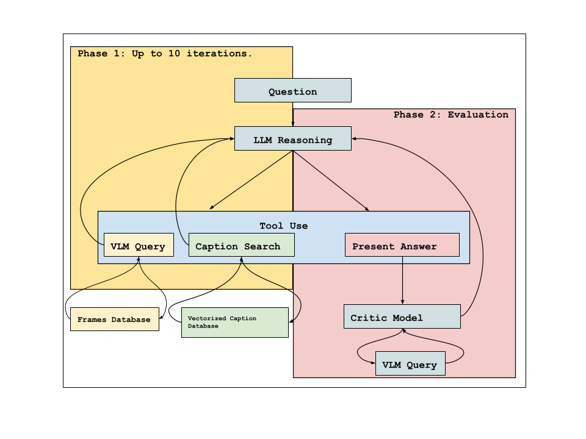
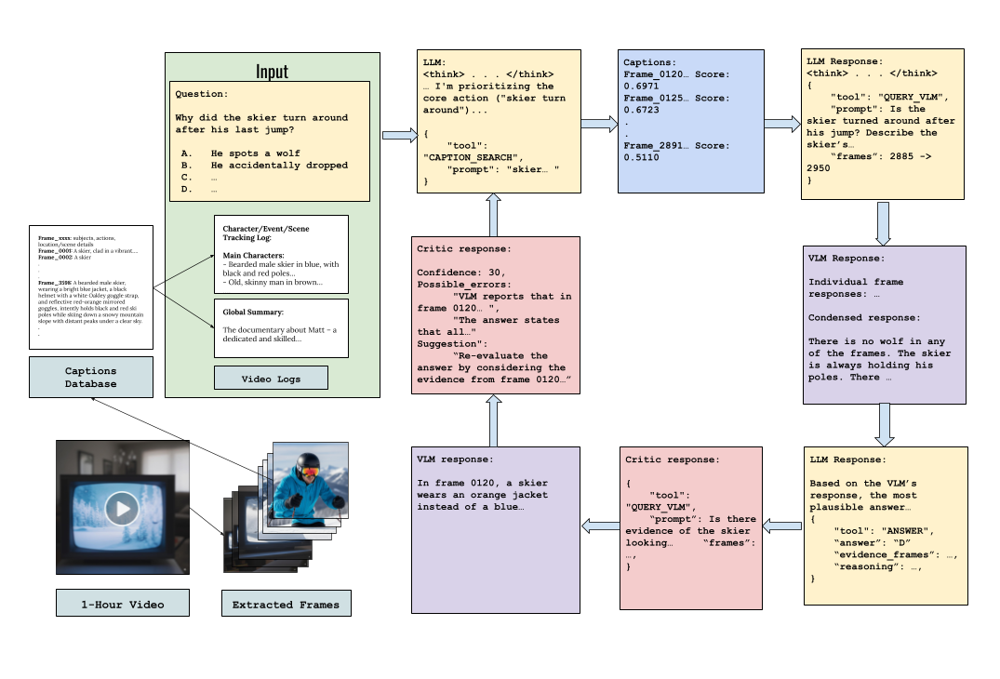

<!-- MathJax setup -->

# Long-Context Video Understanding

*An agentic approach to understanding multi-hour videos through reasoning and critique*

## Abstract

Understanding long videos poses a significant challenge for machine learning models, primarily due to difficulties with temporal recall, comprehension, and context forgetting over extended sequences. We propose an agentic pipeline that leverages the advanced reasoning capabilities of large language models (LLMs) and visual language models (VLMs). Our approach first generates a concise, captioned representation of the long video using a VLM. A ReACT (Reasoning + Acting) framework then operates within this language space, enabling temporal understanding by semantically searching captions for relevant segments and querying the VLM for detailed frame analysis. Crucially, we extend this framework with a novel "critic" module. This independent critic assesses the agent's proposed answers, identifies discrepancies, and prompts re-evaluation, thereby enhancing robustness and accuracy. Evaluated on the LV-Bench dataset, our pipeline achieves a competitive **65.18% accuracy** using only open-source models. The addition of the critic module alone contributes a significant **5% accuracy improvement** over a ReACT-only baseline.

## Introduction

Understanding long videos remains an open challenge in computer vision and machine learning. Current models struggle with temporal recall, video summarization, and reasoning over extended time horizons. A single compressed hour-long video corresponds to nearly **one million tokens**, and multi-hour videos extend far beyond the practical context windows of today's state-of-the-art large language models (Claude: 200k, GPT-4: 128k, Gemini: 1M). Directly inputting such sequences is computationally infeasible, and training models end-to-end on multi-hour videos is expensive.

Yet long videos are pervasive across domains such as healthcare (e.g., surgical recordings, endoscopy), education (lecture and course analysis), and security (surveillance and anomaly detection). There is a fundamental mismatch between how humans consume long videos by distilling them into a handful of key moments, and how current AI systems operate. Effective temporal reasoning over hours of content could allow for the intake of more data, and is crucial to the advancement of general intelligence and interaction with the real world.

We view long-video understanding as an extension of spatial understanding augmented with temporal reasoning. Humans can abstract a video into key frames and events, using them as anchors for reasoning and interpretation. Inspired by this, we hypothesize that large language models (LLMs), when combined with chain-of-thought reasoning and the perceptual grounding of visual language models (VLMs), can reason effectively about long videos even without latent-space temporal encoding.

Formally, we decompose the task into two parts:
1. **Context retrieval:** Selecting the relevant frames or clips from a large video corpus.
2. **Context reasoning:** Using these retrieved elements to answer the posed question.

The first step is especially important for multi-hour content, where providing the entire video as input is infeasible.

We utilize the ReAct framework, which integrates reasoning with tool use. Within this framework, an LLM can both perform step-by-step reasoning and invoke external resources, such as searching through a captions database and communicating with other MLLMs. Prior work such as Deep Video Discovery has explored agentic systems for long-video evaluation, and we build on these ideas and push them further. While reasoning agents are powerful, they remain prone to alignment errors, lossy image-to-text translation, and hallucinations. To address these issues, we introduce a third-party **critic** module that evaluates agent outputs, identifies discrepancies, and prompts re-evaluation. This leads to a novel cycle: *Reason, Act, Critique, React*.

With this design, we combine the reasoning strengths of LLMs and the perceptual grounding of VLMs to build a robust pipeline for answering questions about long-form video.

## Related Work

There are a growing number of models being trained for one-shot or few-shot video understanding, where the goal is to directly process video clips and answer questions or generate captions. For instance, models such as LLaVA and VideoGPT extend vision-language pretraining into the temporal domain. Due to the scarcity of large-scale annotated video datasets, these models are typically trained by leveraging existing labeled image datasets alongside smaller annotated video corpora, aligning both modalities in a shared latent space. Fine-tuning on video QA or captioning tasks further enhances their temporal reasoning abilities. However, these approaches remain limited to relatively short clips, due to the computational constraints of short context windows and the cost of modeling long-distance dependencies.

In parallel, Socratic Models highlight how multimodal reasoning can be composed by chaining independently trained models through natural language. This form of agent interaction and orchestration has also been explored at scale in systems like HuggingGPT, where an LLM coordinates specialized models to solve complex multimodal tasks. Our work is inspired by this line of research, but focuses specifically on the long-video setting, where composition is critical given the infeasibility of end-to-end training on multi-hour data.

Recent capabilities have also been boosted by advances in chain-of-thought reasoning where models explicitly generate intermediate reasoning steps (an "internal scratchpad"). This improves both performance on complex multi-step problems but also the planning ability of LLMs, making them better suited for decomposing long-horizon tasks such as multi-hour video understanding.

Finally, long-context chunking and embedding-based retrieval have emerged as practical solutions for handling inputs that exceed model context windows. Dense retrieval methods enable efficient semantic search across large text or video databases, while hierarchical chunking approaches allow models to zoom in from global summaries to local evidence. These ideas directly inform our design, where multi-granularity captions and semantic embeddings form the reasoning space for an LLM agent.

## Method

Our task is to solve a set of $n$ questions about video $v$:
$$Q_v \ni \{q_1, q_2, \ldots q_n\}.$$

We begin by procuring a set of three video representations at varying granularity:

1. **Frame-centric captions $C_f$**: We extract frames with their timestamps at 1 FPS, and ask a VLM to caption each with a list of objects, their descriptions, and relationships.
2. **Character, Event, and Scene captions $C_c$**: Using our frame-centric captions, we log recurring characters, sequences of frames which capture the same event, and sequences of frames within recurring locations and record corresponding timestamps.
3. **Global summary $C_g$**: Using our frame-centric captions, we curate a global summary with focus on plot, main characters, and general tone of the video.

We keep $C_f$ in a database accessible to the LLM. Captions are written by a VLM, which is prompted to capture significant events, signals, actions, and descriptions of subjects. Each caption is one line to shorten context length and reduce redundancy.

We then embed both sets of captions with an embedding model to enable semantic search.

We equip a reasoning LLM with the following tools:
1. Caption-search function, which embeds prompts, and uses cosine-similarity search to find semantically relevant captions, and their corresponding key frames.
2. Calls to a vision language model (VLM) which reads frames

We feed $C_c$ and $C_g$, which are much more compact, to the model at the beginning of each question so that it can extract relevant and specific information for its caption-search queries, and have a general idea of where relevant frame timestamps lie.

Then, we provide a framework for the LLM to systematically answer each question:
1. Parse the question $q_i$, and write down temporal location, setting, subject, and actions to search for.
2. Using the information from {1}, look through captions $C_f, C_c$ to identify key frames. We allow the model to choose between grep/pattern search, and calls to the semantic caption-finder, and encourage the use/experimentation of both.
3. For each set of key frames found, query a clip of variable length (determined by the model and question) to the MLLM around the key frames to capture relevant context, OR query the VLM with a set of key frames for specific details.
4. Repeat steps 2 and/or 3 as many times as necessary to gather all information.

Step 1 allows the model to organize what it's searching for, corresponding to the question.

In step 2, we encourage the LLM to first search through $C_c$, and find relevant frames.

### LLM Organization Practices

We arm the LLM with a scratchpad file to keep a chunkable reference memory as it searches. We also enforce that it records exact clip/frame evidence and reasoning in a file. Ablating with and without the scratchpad show a negligible increase in accuracy.

### Predictability + Critic

We notice a high variance in accuracy across runs with the exact same prompts, captions, and hyperparameters. This is due to the compounding probabilistic nature of autoregressive generative models and the complex and open-ended nature of our back-and-forth task.

We know that our LLMs are capable of complex reasoning paths to solve long video understanding questions because their reasoning traces match the human thought process. However, LLMs can be thrown off at any point in reasoning (wrong key frames, misidentification of subjects, misunderstanding of the question), causing a high variance in accuracy across different seeds.

To mitigate, we test a critic system:

Once our reasoning LLM has decided on a final answer, it outputs a json containing its answer, evidence frames, and reasoning. This is fed to another reasoning critic LLM along with the question and global context. The critic LLM reads the reasoning trace, calls a VLM on the evidence frames, and looks for discrepancies in the frames, holes in the reasoning, or incomplete evidence. It returns a confidence score and suggestions for re-evaluation. Upon passing below a selected threshold (70%), we send the critique to the original LLM for re-evaluation.

The use of a single pass through the critic model increases accuracy by **5.98%**.

## Experiments

We run experiments on a few open source models, with and without scratchpad, with and without a critic model, and on different datasets.

Deepseek V3.1 performs the best on open-source models, reaching an accuracy of **65.18%** with a critic model, **60.19%** without on LVBench.

## Challenges

### Why this problem is important

Current research on long context often focuses on embedding video context into a model's embedded memory. However, this is compute-intensive and limits the length of videos model can take in. Instead, we aim to combine the capabilities of language reasoning models and image-spatial understanding models to understand long videos with a mix of information retrieval (zooming in on important sections) and temporal reasoning in the language space. This also allows a large amount of context to lie outside the model's memory, but remain accessible to the model.

### Finding an accurate/concise representation of a video

We are looking for a searchable space for a model to reason over. Video captioning models which embed temporal information to a latent space are weak, due to the sheer size of video input. A good representation should give a model enough signal for specific information retrieval and scene recognition, but not overwhelm a model with distracting context. Human questions about videos lie in the language space, so a natural video representation is captioning of individual frames, and allowing models to reason temporally through timestamps and their corresponding captions.

We tested models with long, detailed captions, short captions, etc.

We found that including a broad global caption of the video (llm compresses frame captions in a summary, with character tracking and event sequences) which identifies/describes recurring characters also provides good context for the LLM, and shapes the questions it asks.

### Optimal search method

Once given a reasoning space for the video, models should search the space. Most questions can be broken into subquestions, and answered given a few key frames of a video.

**Example:** "Why did the protagonist pull her sword on the chef?"

A reasoning model should extrapolate that it needs to identify the protagonist, chef, find the confrontation scene between them, and zoom in on this scene.

- Global captions are good for identification of the protagonist, and retrieval of their appearance.
- Then, the model can search for scenes of cooking/chef to identify a chef.
- From there, a reasoning model can search for scenes of sword-pulling with both these characters and zoom in on these.

Models searching over text (grep/find of certain words) was not as good as semantic embedding similarity search.

Ideas I didn't get to test: hierarchical representation of a video. ideally like a binary search over different levels of breadth of caption/representation.

### Being able to correctly identify key-frames and when to move on

Model will hallucinate information to try to push an answer choice when it identifies a scene. Maybe a confidence measure?

### Undeterministic behavior

Have a critic (this was unstable), or have a majority voting system or a verifier.

---
